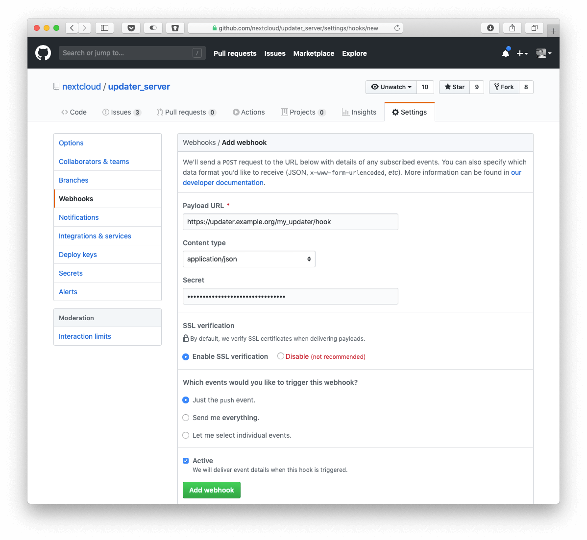

This is the server that is called from Nextcloud to check if a new version of the server is available.

## How to release a new update

1. Adjust config/config.php for the update
2. Adjust tests/integration/features/update.feature for the integration tests

If the tests are not passing the test execution will fail.

## Push to production
Open a PR from master to the `production` branch:
https://github.com/nextcloud/updater_server/compare/production...master

## Example calls

Deployed URL: https://updates.nextcloud.com/updater_server/
Example call: updater_server/?version=9x0x0x12x1448709225.0768x1448709281xstablexx2015-10-19T18:44:30+00:00%208ee2009de36e01a9866404f07722892f84c16e3e
```xml
<?xml version="1.0" encoding="UTF-8"?>
<nextcloud>
 <version>9.0.51</version>
 <versionstring>Nextcloud 9.0.51</versionstring>
 <url>https://download.nextcloud.com/server/releases/nextcloud-9.0.51.zip</url>
 <web>https://docs.nextcloud.com/server/9/admin_manual/maintenance/upgrade.html</web>
</nextcloud>
```

## Webhook deployment

If you wish to receive webhooks and then automatically deploy the lastest version of the updater server there is one special API endpoint available.

For this the [Github Webhook](https://developer.github.com/webhooks/) needs to be configured to send `push` events to the endpoint `/hook` of the updater server. There only the ending part is crucial. That means that any URL ending in `/hook` which is served by the `index.php` of the updater server will trigger this behaviour.

Configure a webhook on Github in the repository of choice with `application/json` as content type, a random secret and the `push` event to be sent.



Then place a file `config/secrets.php` (see `config/secrets.dist.php` as example) with the same secret and the branch it should trigger on.

Once this is done the updater server will run a `git pull` in the directory of the `index.php` every time a valid event comes which matches the secret and then branch name. Keep in mind that the directory needs to be writable by the user under which PHP runs (most likely the webserver user).
